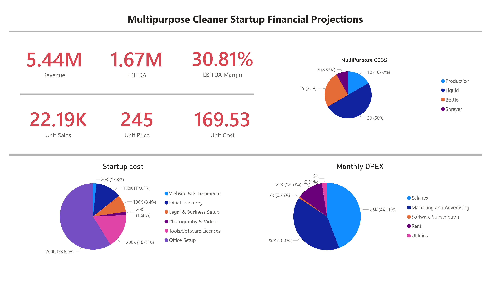

# Project Name: Startup Financial Dashboard & Projections

This project contains financial projections and dashboards used to analyze and forecast startup business performance. It includes a Power BI dashboard and Excel sheet detailing key financial metrics, along with a PDF summary of the financial projections.

## Files Included

- **Dashboard.pbix**: A Power BI file containing an interactive financial dashboard, offering insights into revenue, costs, and other key business metrics.
- **Financial_Projections.xlsx**: An Excel spreadsheet detailing startup costs, monthly operating expenses (OPEX), revenue projections, and more. This sheet serves as a financial model for the project.

## Dashboard Preview

Here is a preview of the financial dashboard created in Power BI:

  

## Features

- **Power BI Dashboard**:
  - Revenue and unit sales insights
  - EBITDA and margin calculations
  - Startup cost breakdown
  - Monthly operating expenses (OPEX)
  - Product cost structure and pricing model
  - Visual representation of financial forecasts
  
- **Financial Projections (Excel)**:
  - Detailed revenue and expense breakdowns
  - Start-up costs and initial investments
  - Profit and loss projections
  
